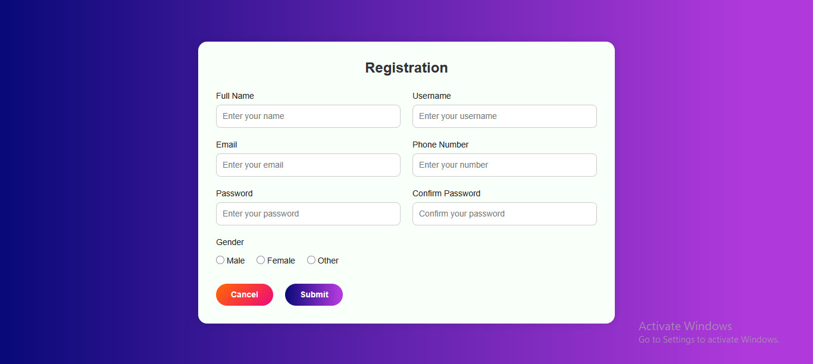
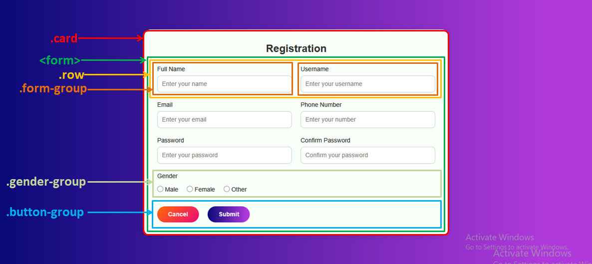

# Module 12: Task-1 - Registration Form using HTML and CSS

This is a simple Registration Form designed using only **HTML** and **CSS**.

## Webpage Screenshot
>   

## Layout Design Strategy
> 

## Project Presentation Video
> 
> 

## How to Use
1. Clone or download the repository.
2. Open `index.html` in your browser.

