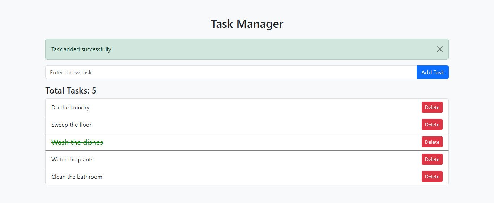

# Module 12: Task-2 - Task Manager with JavaScript & Bootstrap

This is a simple Task Manager built using **HTML**, **Bootstrap 5.3**, and **Vanilla JavaScript**. The app allows to:
- Add Task
- Delete Task
- Display Tasks Dynamically
- Display Number of Tasks Dynamically
- Mark Tasks as Completed

## Webpage Screenshot
> 

## Project Presentation Video
> 

## How to Use
1. Clone or download the repository.
2. Open `index.html` in your browser.
3. Add, delete or mark completed tasks as needed!

